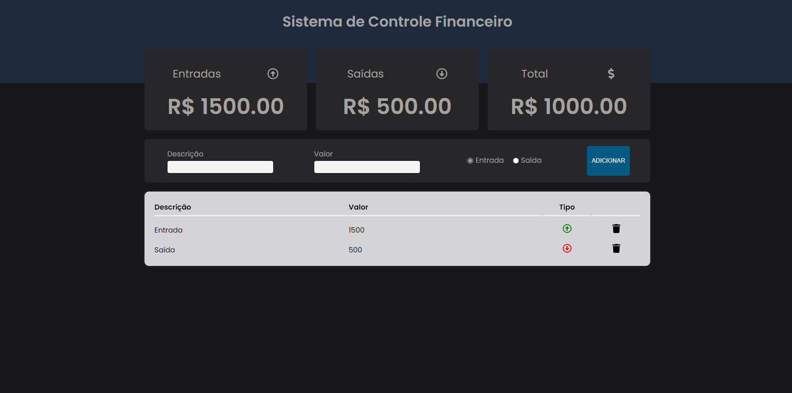

<h1>Sistema de Controle Financeiro</h1>

Esse é um sistema básico para aplicação de aprndizagem, um controle simples de entradas e saídas.

#Técnologias usadas:
  <ul>
    <li>React;</li>
    <li>Styled Components;</li>
    <li>Dados salvos no localstorage;</li>
  </ul>

  